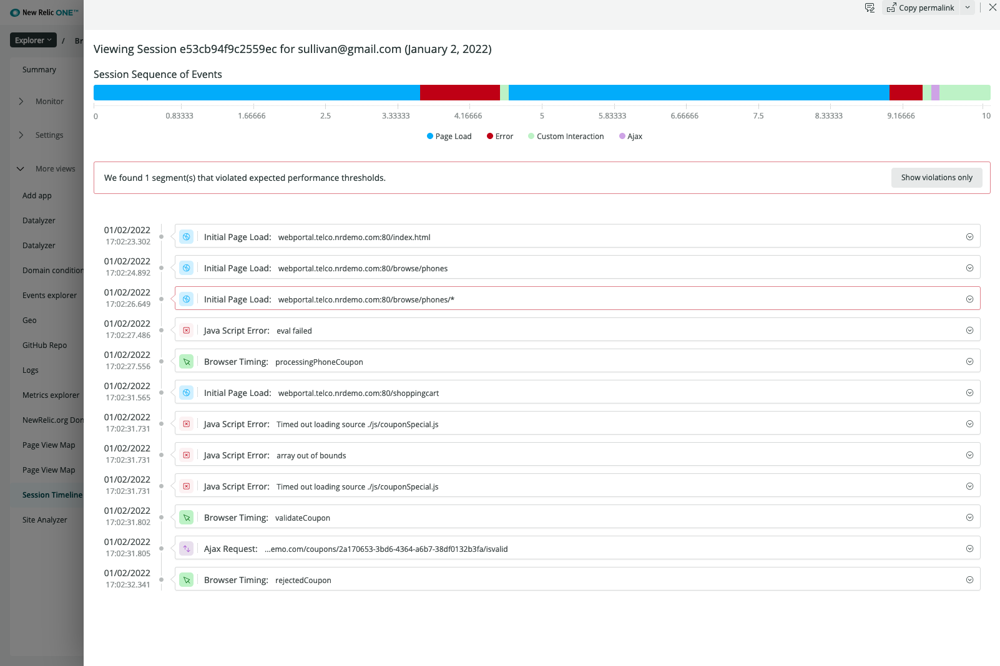
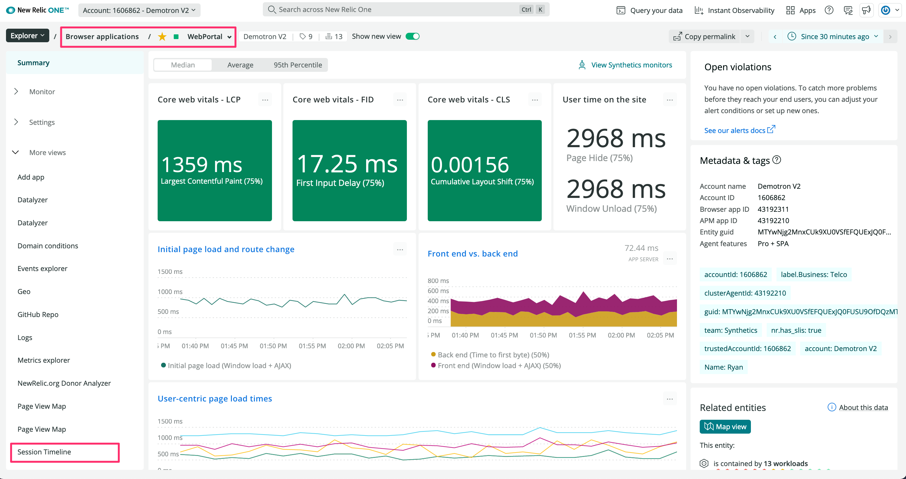
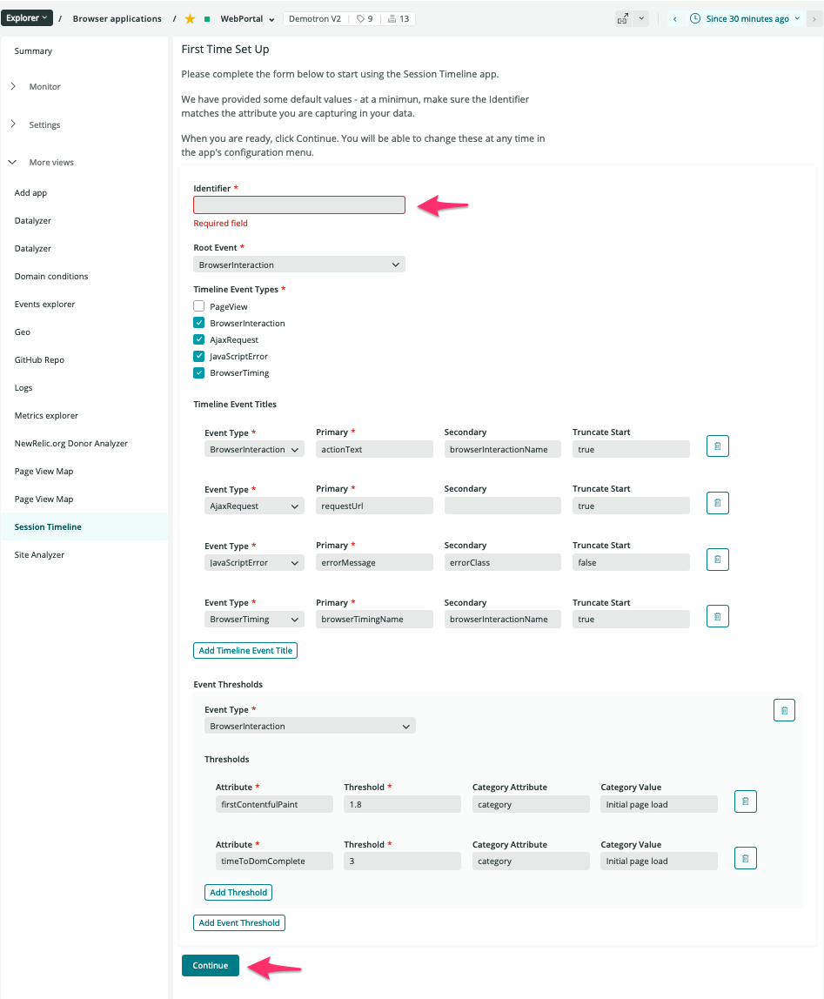
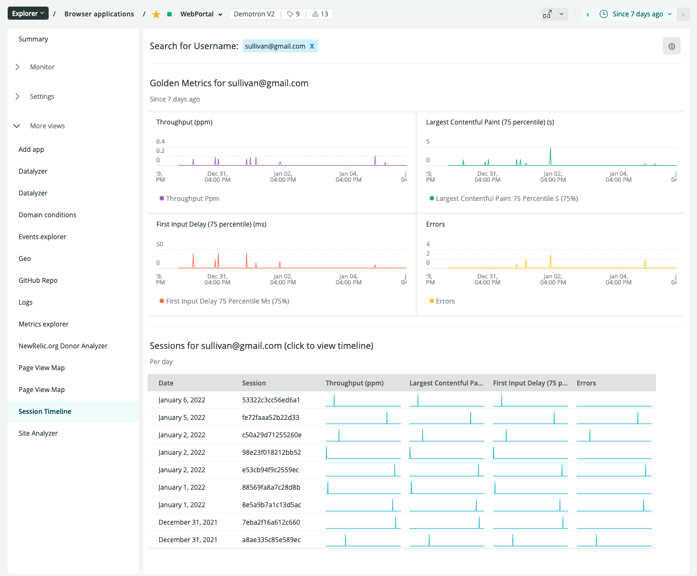
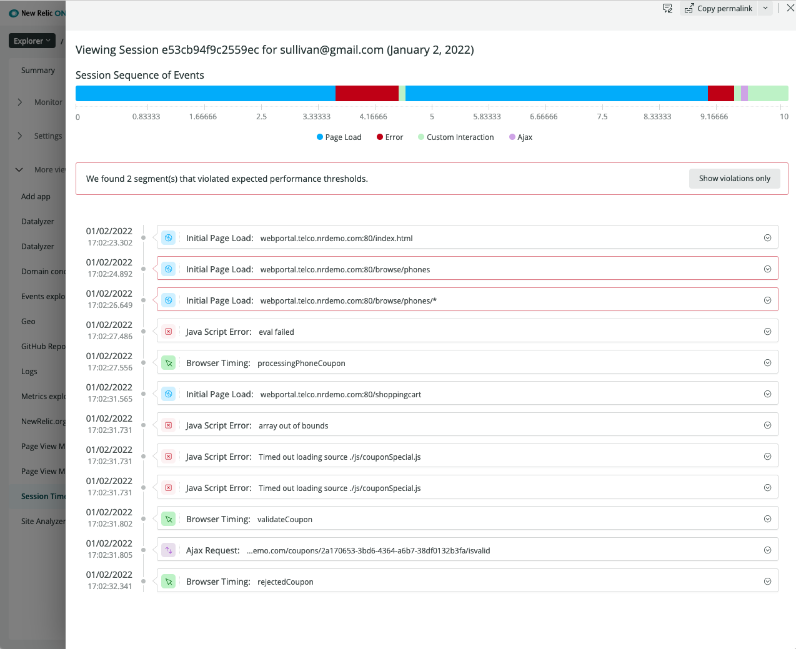
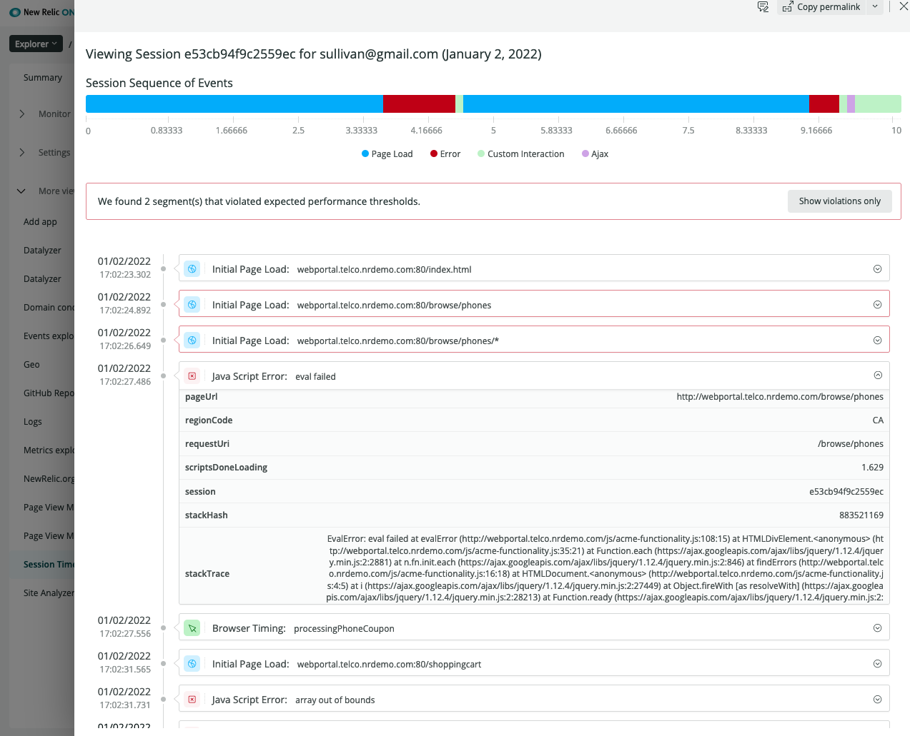
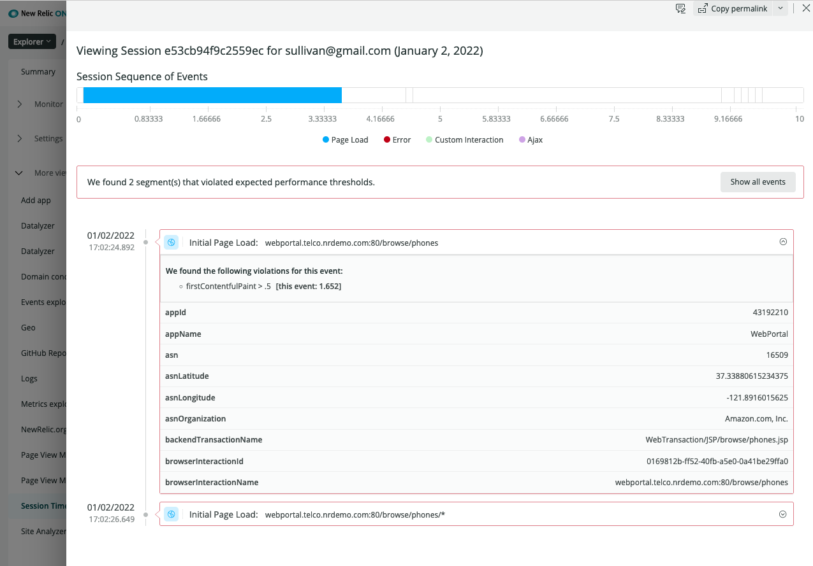

- [Session Timeline](#intro)
  - [License](#license)
  - [Use Cases](#use-cases)
  - [Usage](#usage)
    - [Pre-requisites](#pre-reqs)
    - [App Installation](#install)
    - [Basic Usage](#usage)
      - [Accessing](#access)
      - [First time set up](#set-up)
      - [Search for a user](#search)
      - [User summary view](#summary)
      - [Timeline view](#timeline)
    - [Advanced Usage](#advanced)
      - [Configuration](#config)
      - [Changing defaults](#defaults)
- [Support](#support)
  - [Issues and Roadmap](#issues)
  - [Security](#security)

# Introduction 

Session Timeline provides a detailed understanding of the experience of an individual user in a browser or mobile application. The app includes:

- Summarized golden metrics
- An event stream of all events triggered by a specific user session
- A distribution of events alone a gauge showing total elapsed time
- A drilldown showing all attributes recorded for each event in the event stream
- Ability to filter the event stream to view only events of a specific category
- Ability to define performance thresholds for specific event types and flag events that breach those thresholds

## Open source license <id id="license"></id>

This project is distributed under the [Apache 2 license](LICENSE).

This project also uses source code from third-party libraries. You can find full details on which libraries are used and the terms under which they are licensed in the [third-party notices](THIRD_PARTY_NOTICES.md) document.

## Usage 

### Use Cases 

1. Respond to a specific customer care support request

   Customer care support teams receive support requests about individual users - in order to resolve these requests, they need to understand exactly what happened to that user while interacting with a web site or app, and the order it happened in. Session Timeline offers a fast and simple mechanism to load the sequence of events experienced by a user in a specific session, and view the full details of each event.

2. Enhance troubleshooting investigations

   Performance problems can often be caused by unexpected combinations of requests and user behaviours. When attempting to identify the underlying cause of a broader issue, it can be useful to dig into the details of specific interactions that encountered the problem. Session Timeline presents the entire sequence of Browser or Mobile events triggered by individual sessions, and can potentially help surface unusual and problematic patterns.

### Pre-requisites 

Session Timeline requires that you have the [Browser agent](https://docs.newrelic.com/docs/browser/browser-monitoring/getting-started/introduction-browser-monitoring/) or [Mobile agent](https://docs.newrelic.com/docs/mobile-monitoring/new-relic-mobile/get-started/introduction-mobile-monitoring/) deployed to your site or app.

You will also need to set up your [development environment](https://developer.newrelic.com/build-apps/set-up-dev-env/) to test and deploy NR1 Apps.

### App Installation 

- Clone the repo
- run `npm install`
- run `nr1 nerdpack:uuid -gf`

Follow these instructions to [test locally](https://developer.newrelic.com/build-apps/publish-deploy/serve/).

Follow these instructions to [publish](https://developer.newrelic.com/build-apps/publish-deploy/publish/) the app to New Relic, and [subscribe](https://developer.newrelic.com/build-apps/publish-deploy/subscribe/) your account to use it.

### Basic Usage Guide 

- [Accessing](#access)
- [First time set up](#set-up)
- [Search for a user](#search)
- [User summary view](#summary)
- [Timeline view](#timeline)

#### Access 

Once deployed, session timeline will become an available for any of your account's browser or mobile apps. Simply navigate to the target app, and you will see Session Timeline as an option in the "More Views" menu in the left-hand pane.

 

#### First-time set up 

When you first access the application for a given browser or mobile application, you will need to go through a minimal set up step. You will be presented with a configuration page that is pre-popluated with some default values specific to the type of app (Browser or Mobile).

At a minimum, you will need to specify the attribute used to locate session data. Ideally, this is a value that uniquely identifies a user, such as an email, user id or token. If you don't have a user identifier recorded in your Browser or Mobile data, it is simple to add using custom attribute ([browser](https://docs.newrelic.com/docs/browser/new-relic-browser/browser-agent-spa-api/setcustomattribute-browser-agent-api/)) ([mobile](https://docs.newrelic.com/docs/mobile-monitoring/new-relic-mobile/maintenance/add-custom-data-new-relic-mobile/)).

Once the Identifier attribute is set, you can modify the remaining config values, or click the Continue button to accept the defaults and start using Session Timeline.

See the [Configuration](#config) section for complete defintions of the app configuration options and how to use the form.

 

#### Search for a user 

Once you have completed the initial set up, Session Timeline will present you with a search page. In order to view the details of a user's experience, you need to first locate that user.

Enter the user identifier you are targeting in the "Search for [Identifier]" text field.

As you type, you will be presented with a list of matching results. Once you see the target identifier, click on it to display the summary view for that user.

Note: matches are located for the time period active in the platform timepicker. If you aren't seeing the expected identifier show up in the list, make sure you have correct time period set.

 

#### User summary view 

Once you have selected a user, you will be presented with a screen showing an overview of that user's experience with the application for the active time period.

This overview contains two sections:

- golden metrics, giving you a quick understanding of the user's overall quality of experience
- a tabular listing of all the sessions generated by that user in the time period, with the golden metrics associated to each session

To drill into the details for a specific session, click on the appropriate table row to open the Timeline view.

_A note about Browser sessions: Session Timeline relies on the [Browser agent session attribute](https://docs.newrelic.com/docs/browser/browser-monitoring/page-load-timing-resources/cookie-collection-session-tracking/) to connect related browser events together. The New Relic session can be very long-lived, even spanning across multiple days. Session Timeline will timebox long-lived sessions into daily chunks, to help keep the amount of data considered in the timeline view meaningful. In this way, you may see the same session id repeated multiple times in the table - that simply means that the user's browser was not closed in that timeframe._

 

#### Timeline view 

The Timeline view presents the full set of events recorded in New Relic related to a selected session, for up to one day's worth of data.

The events are presented both as a timeline showing a simple visualization of the order of categorized events, as well as an event stream showing the time-stamped listing of all the individual events recorded for that session.

In the example below, you can scan the list of events to easily see how the user navigated through the site, as well as when errors were encountered.

 

Click on an event in the listing to show all the attributes that were collected for that event, and assist with additional analysis.

 

If the event segment violates a [configured](#config) performance threshold, it is outlined in red. You can click on the "Show violations only" button to filter the list of events only to those that are in violation. Expanding the event will show the specifics of how that event is in violation.

 

Each event is grouped into a category based on the underlying data, and the timeline chart represents the events based on their grouping. Clicking on the chart legend allows you to quickly filtering both the chart and the event listing to show only events for the selected categories.

 

### Advanced Usage 

#### Configuration 

- [Configuration scope](#scope)
- [Reset to defaults](#defaults)
- [Attributes](#attributes)
  - [identifier](#identifier)
  - [root event](#root-event)
  - [grouping attribute](#grouping)
  - [timeline event types](#timeline-event-types)
  - [timeline event titles](#timeline-event-titles)
  - [event thresholds](#event-thresholds)

Many of the parameters used by Session Timeline can be adjusted in the Configuration screen. To access this screen, click on the gear icon in the upper right corner of the Overview screen.

 

##### Configuration Scope 

The configuration settings are specific to the **entity**, but are common to **all users**: if you make a change, all users in the account will be affected by that change, but they will be applied only to the active entity (not to all entities of that type).

##### Reseting to defaults 

Click on the "Reset to Defaults" button in the configuration form to revert to the default configuration set up. Be sure this is what you want to do - it will permanently delete your existing settings for the entity, and cannot be undone. Once reset, you will be prompted to complete the [first time set up](#set-up).

 

##### Attributes 

- `identifier` 

  The `identifier` attribute is used to search the [`root event`](#root-event) for the unique set of [`grouping attributes`](#grouping) from which we can build the timeline views. It is recommended that the `identifier` is set to something that uniquely represents a user in your application, such as email or user id.

- `root event` 

  The `root event` is the event type used to located the target set of [`grouping attributes`](#grouping). We will search the `root event` for all unique `grouping attributes`, which are used to build the [timeline views](#timeline).

  In a typical browser configuration, the `BrowserInteraction` acts as the `root event`. Every browser transaction creates a `BrowserInteraction` event, meaning that it has the broadest scope of data and makes the most sense for us to use to find the sessions we need. For Mobile apps, we use the `Mobile` event type, as it provides the broadest scope of data.

  It is not recommended to change this value, unless this is a Browser app and you are not using the Browser SPA agent. In this case, set the `root event` to `PageView`.

- `grouping attribute` 

  NOT MODIFIABLE. The `grouping attribute` is used to locate the full set of events shown in the [timeline view](#timeline). For Browser, the `grouping attribute` is `session`. For Mobile, the `grouping attribute` is `sessionId`.

- `timeline event types` 

  The set of event types that will be included when building the [timeline view](#timeline). The available events are restricted to include only event types relevant to the application (Browser or Mobile event types).

  All selected event types will be searched for matches to the [`grouping attribute`](#grouping-attribute), which will be presented in the timeline.

  For Broswer apps, if you are not using the Browser SPA agent, it is recommended that you deselect `BrowserInteraction` and select `PageView`

- `timeline event titles` 

  `Timeline event titles` allow you to determine which attribute should be displayed at the top level of a timeline event item.

   

  The title is specific to event type - it is recommended you define a title setting for each event type selected in [`timeline event types`](#timeline-event-types), although it is not required.

  For each event type, you can specify:

  - `primary`: the first attribute to search for and display in the title
  - `secondary`: the attribute to display if the primary attribute is blank
  - `truncate start`: truncate behaviour to apply to long values. `true` if the beginning should be truncated, `false` if the end should be truncated.

- `event thresholds` 

  Event thresholds allow you to define performance thresholds for specific attributes, and are entirely optional.

  You can define multiple threshold rules for each event type. An event threshold rule consists of:

  - `attribute`: the attribute that will be evaluated against the threshold
  - `threshold`: the threshold value. Events that exceed the threshold will be considered in violation.
  - `category attribute`: (optional) this allows you to include an additional attribute to the scoping of the threshold. If present, only events where the `category attribute = category value` will be included in the evalution
  - `category value`: (mandatory if category attribute is present) the value of the `category attribute` to include in the evaluation

  As an example, the default Browser configuration includes this threshold rule:

   

  You can translate this rule into: _Mark in violation any BrowserInteraction event where category is 'Initial Page Load' and firstContentfulPaint exceeds 1.8 seconds._

  You can remove existing rules, or entire event type blocks, but clicking on the various garbage can icons.

#### Changing defaults 

The structure and behaviour of the configuration is defined in a javascript file called `packSchema`, found in `src/data`. It is not recommended to change the schema definitions unless you are making broader changes to app behaviour in general.

The default settings for Mobile and Browser are defined in a javascript file called `packDefaults`, found in `src/data`. If you would like to change the default configuration used for all apps of a given type, you can make those changes in the `packDefaults` file.

Note that any changes made to `packDefaults` will not overwrite the active configuration for any entities that have already gone through the first time set up.

# Support 

New Relic has open-sourced this project. This project is provided AS-IS WITHOUT WARRANTY OR DEDICATED SUPPORT. Issues and contributions should be reported to the project here on GitHub.

We encourage you to bring your experiences and questions to the [Explorers Hub](https://discuss.newrelic.com) where our community members collaborate on solutions and new ideas.

## Issues and Roadmap 

To view a listing of enhancement requests and known bugs, please visit the repository [issues page](https://github.com/newrelic-experimental/nr1-session-timeline/issues).

If any active work is ongoing in Session Timeline, the scope will be defined in the repository [projects](https://github.com/newrelic-experimental/nr1-session-timeline/projects)

Contributions are encouraged! If you submit an enhancement request, we'll invite you to contribute the change yourself. Please review our [Contributors Guide](CONTRIBUTING.md).

Keep in mind that when you submit your pull request, you'll need to sign the CLA via the click-through using CLA-Assistant. If you have any questions, or to execute our corporate CLA, required if your contribution is on behalf of a company, please drop us an email at opensource@newrelic.com.

## Security 

New Relic is committed to the privacy and security of our customers and their data; review our [security policy](https://github.com/newrelic-experimental/nr1-session-timeline/security/policy) for details.
